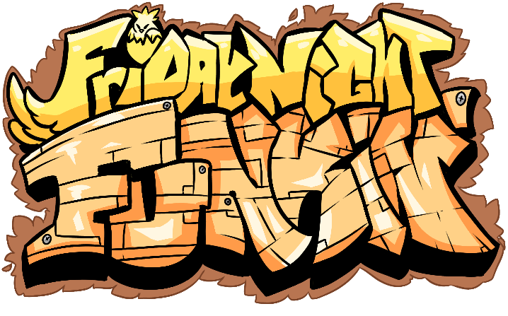

## NOTICE!!
This project isn't really ready for modding just yet, it's riddled with issues and was made public for the soul purpose of public testing and feedback, hope you understand

in the meantime, check out [Nova Engine](https://github.com/swordcube/NovaEngine-Godot-FNF)

-------------------------------------

# Friday Night Funkin': Feather Godot
<em>Made as a tribute to Friday Night Funkin' and its modding community.</em>

the Godot Version is very much a successor to the HaxeFlixel Version.

-------------------------------------
## [Credits]

* [BeastlyGabi (me!)](https://twitter.com/BeastlyGabi)
    * Made the Engine
    * idiot, a dumbass perhaps
* [swordcube](https://twitter.com/swordcube)
    * Taught me a lotta things and overall helped me a TON on understanding godot
    * it's because of him that this project is even moving to godot in the first place (and I'm glad it is!)
